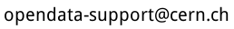

# CMS Event Display materials in multiple languages
This repository contains material for classroom activities using CMS Event Display. Materials include tutorial and classroom activities in multiple languages. The languages are labeled with 2 letter abbreviations following ISO 639-1 codes (see https://en.wikipedia.org/wiki/List_of_ISO_639-1_codes).

This material is made available under a CC-BY licence https://creativecommons.org/licenses/by/4.0/

## Using the material
You can download single files by selecting a file and clicking _Download_ button on the right. To download the whole repository as ZIP, click _Clone or download_ at the front page.     

## Contributing
Contributions are encouraged and welcome! To contribute, see our general [Contributing guide](https://github.com/cms-opendata-education/cms-jupyter-materials-english/blob/master/Contributing.rst) or send an email to 
 

If you create new files, please name them in following form:  
[LANGUAGE ABBREVIATION]-[activityName].[format]  
e.g. EN-eventDisplayTutorial.pdf
